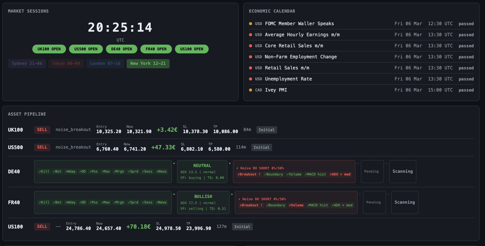

<div align="center">

# INTRA

### Intraday Noise Boundary Momentum Bot

[](https://python.org)
[](https://fastapi.tiangolo.com)
[](https://open-api.capital.com)
[](LICENSE)

Automated intraday CFD trading bot implementing the **Noise Boundary Momentum** strategy from [Zarattini, Aziz & Barbon (2024)](https://papers.ssrn.com/sol3/papers.cfm?abstract_id=4824172). Trades index CFDs on Capital.com with fully mechanical entries, adaptive risk management, and a real-time dashboard.

Paper results on SPY (2007-2024): 19.6% annualized, Sharpe 1.33, beta near zero.

[Strategy](#strategy) · [Pipeline](#pipeline) · [Exit Management](#exit-management) · [Risk System](#risk-system) · [Dashboard](#dashboard) · [Setup](#setup)

</div>

---

## Strategy

Based on the paper *"Beat the Market: An Effective Intraday Momentum Strategy for S&P500 ETF (SPY)"* (Swiss Finance Institute, 2024). Independently replicated on ES/NQ futures by [Quantitativo](https://www.quantitativo.com/p/intraday-momentum-for-es-and-nq).

### Core Concept

Each trading day, a **noise zone** is computed around the daily opening price:

```
noise_upper = daily_open + avg(|daily_return|, last 14 days)
noise_lower = daily_open - avg(|daily_return|, last 14 days)
```

While price stays inside this zone, demand and supply are in balance and no trade is taken. When price breaks beyond a boundary at a full or half hour (:00 or :30), a position is opened in the breakout direction. All positions are closed before session end, no overnight risk.

### Why It Works

The noise boundary separates random price fluctuation from genuine demand/supply imbalance. A breakout beyond the statistical noise zone signals directional momentum. The 30-minute check interval filters short-lived fake breakouts.

### Signal Confidence

Each breakout is scored from 0.0 to 1.0 based on four confirmation factors:

| Factor | Weight | What's Measured |
|--------|--------|-----------------|
| Breakout strength | 0.40 | Distance beyond boundary in ATR units |
| Volume confirmation | 0.30 | Current volume vs 20-period average |
| MACD histogram | 0.15 | Momentum alignment with breakout direction |
| ADX above median | 0.15 | Trending market favors sustained breakout |

Minimum confidence to trade: 50%.

---

## Pipeline

Every potential trade passes through four sequential layers. Any layer can veto.

**Layer 1: Risk Constraints** — Session times, spread, margin, news blackout, cooldowns, position limits. If any check fails, the trade is blocked before signal detection even runs.

**Layer 2: Signal Detection (1min)** — At :00 and :30, check if price has broken the noise boundary. Score confidence from confirmation factors. Needs at least 50% to proceed.

**Layer 3: Trade Validator** — Compute ATR-based SL, check spread filter (SL >= 3x spread). No fixed TP, exits are handled by trailing stop and EOD close. After 20 trades, the stats-based EV gate blocks setups with negative expected value.

**Layer 4: Position Sizing** — Half-Kelly from accumulated statistics, capped at 3% risk and 3x leverage. Correlation-adjusted exposure prevents hidden concentration.



### SL Computation

```
SL = 1.5 * ATR(15min)
```

No fixed take profit. Exits are managed by trailing stop, dead trade detection, and EOD close (paper-conformant).

Kurtosis > 3.0 widens SL. Continuous volatility adjustment scales by ATR/ATR_avg (clamped 0.7 to 1.5). SL must be at least 3x the current spread.

---

## Exit Management

Three exits only, paper-conformant. No breakeven stage, no time-based exits.

**SL (Capital.com-side)** — 1.5 * ATR(15min), adjusted for kurtosis and volatility. Must be at least 3x spread. Managed by the broker, executes even if bot disconnects.

**Trailing Stop at +1.0R** — When profit reaches 1.0R, a trailing stop activates with distance = max(1.2 * ATR, stats-derived optimal distance). Lets winners run while locking in gains.

**EOD Close** — 5 minutes before session end, all positions are closed. No overnight risk, paper-conformant.

```
Every 2 seconds while position is open:
  Position gone from API?  -> SL hit (Capital.com closed it)
  P&L >= +1.0R?           -> Activate trailing stop
  Session ending?          -> Close (EOD)
```

---

## Risk System

### StatisticsEngine

All trading parameters adapt as trade data accumulates:

| Parameter | Source | Fallback |
|-----------|--------|----------|
| Risk per trade | Half-Kelly fraction | 1.0% during bootstrap |
| Trailing distance | 30th percentile of win distribution | 1.2 * ATR |
| EV gate | WR * TP_eff - (1-WR) * SL_eff | RRR >= 1.2 |

Statistics are tracked per setup type and per instrument. Persisted in `stats.json`.

### Position Sizing

Half-Kelly fraction, capped at 3%. Bootstrap phase uses 1.0%, negative edge drops to 0.5%. Leverage capped at 3x balance.

Effective position count uses pairwise correlations: 3 long positions in correlated European indices count as ~2.7 effective positions. Max effective exposure is 2.5.

### Pre-Trade Constraints

| Check | Threshold |
|-------|-----------|
| Daily loss limit | 3% of balance from daily peak |
| Position per instrument | Max 1 |
| Simultaneous positions | 4 hard cap |
| Correlated exposure | 2.5 effective positions |
| Available margin | Min 20% of equity |
| Spread filter | Current > 1.5x average |
| Session buffers | No trades first 10min or last 20min |
| News blackout | 15 min before high-impact events |
| Consecutive SL hits | 3 per instrument pauses it |
| Cooldowns | 60s global, 10min per signal/instrument |

---

## Instruments

Index CFDs on Capital.com with nearly 24-hour weekday sessions.

| Instrument | Epic | Session (UTC) |
|------------|------|---------------|
| DAX 40 | `DE40` | 00:00 - 21:00 |
| CAC 40 | `FR40` | 00:00 - 21:00 |
| NASDAQ 100 | `US100` | 00:00 - 21:15 |
| S&P 500 | `US500` | 00:00 - 21:15 |
| FTSE 100 | `UK100` | 00:00 - 21:00 |

Each instrument runs independently with its own signal state, position, and circuit breakers.

---

## Dashboard

Real-time single-page web interface via WebSocket.


Shows account info, bot controls, the asset pipeline per instrument (constraints > signal > validation > status), daily drawdown, market sessions, economic calendar, equity curve, win rates, recent trades (filterable), and a live log viewer.

---

## Setup

### Requirements

- Python 3.12+
- Capital.com account (demo or live)
- Capital.com API key

### Install

```bash
git clone https://github.com/Plain2Code/INTRA.git
cd INTRA
pip install -r requirements.txt
cp .env.example .env
# Fill in your Capital.com credentials
```

### Run

```bash
python main.py          # demo mode (default)
python main.py --live   # live mode
python main.py --port 9090
```

Open the dashboard, select instruments, click **Start Bot**.

### Environment Variables

```env
CAPITAL_EMAIL=your-email@example.com
CAPITAL_PASSWORD=your-password
CAPITAL_API_KEY=your-api-key
CAPITAL_MODE=demo
```

### Docker

```bash
docker compose up -d --build
ssh -L 8080:127.0.0.1:8080 root@YOUR_SERVER -N &
open http://localhost:8080
```

---

## Architecture

```
orchestrator.py              Event loop, exit management, trade recording
core/
  statistics.py              EV, Kelly, correlation, adaptive parameters
  feature_engine.py          Indicators (talipp) + noise boundary computation
  capital_client.py          Capital.com REST + WebSocket (auto-reconnect)
  data_feed.py               Candle buffers: 1min, 15min, daily
  news_filter.py             Economic calendar blackout
pipeline/
  setup_engine.py            Noise Breakout detection (confidence-based)
  trade_validator.py         SL/TP + spread-adjusted EV gate
  risk_constraints.py        Pre-trade safety checks
  regime_classifier.py       Volatility tagging
execution/
  risk_manager.py            Half-Kelly sizing + correlation adjustment
  order_executor.py          Order lifecycle
  trade_tracker.py           Trade recording, feeds StatisticsEngine
  state_manager.py           Daily PnL, circuit breakers, kill switch
dashboard/
  api.py                     FastAPI + WebSocket server
  static/index.html          Single-page dashboard
config.py                    Infrastructure constants
```

### Persistent Files

| File | Content |
|------|---------|
| `trades.json` | Completed trades with context (hold time, exit reason, confidence, ATR, spread) |
| `stats.json` | Rolling statistics per setup type (win rate, EV, Kelly, PnL distribution) |
| `active_assets.json` | Selected instruments |

---

## References

- Zarattini, C., Aziz, A., & Barbon, A. (2024). *Beat the Market: An Effective Intraday Momentum Strategy for S&P500 ETF (SPY)*. Swiss Finance Institute. [SSRN](https://papers.ssrn.com/sol3/papers.cfm?abstract_id=4824172)
- Maroy, A. (2025). *Improvements to Intraday Momentum Strategies Using Parameter Optimization and Different Exit Strategies*. [SSRN](https://papers.ssrn.com/sol3/papers.cfm?abstract_id=5095349)
- Independent replication on ES/NQ futures: [Quantitativo](https://www.quantitativo.com/p/intraday-momentum-for-es-and-nq)

---

<div align="center">

**INTRA** — Paper-backed intraday momentum, no black boxes.

</div>
